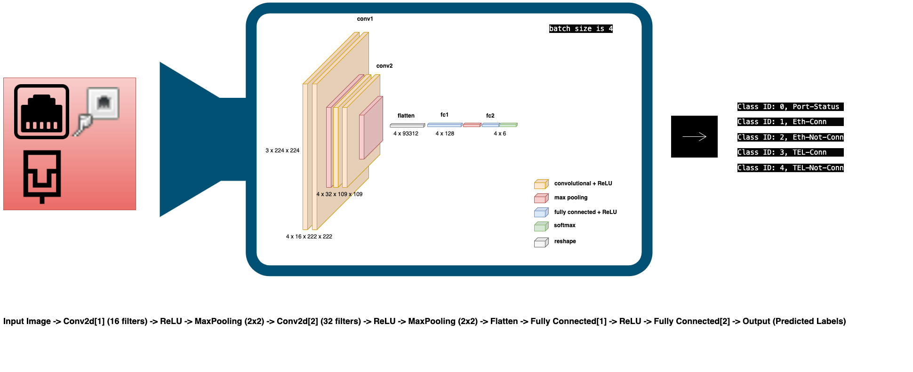

# edgedev_port_detection

This Python script presents a solution for deploying a Convolutional Neural Network (CNN) model on edge devices to detect the status of ports and cables. It is designed to be user-friendly, allowing technicians to simply capture an image of the edge device using a camera, and then utilize the trained model to infer the status of ports and cables. The script utilizes PyTorch for model training and inference and torchvision for dataset handling. It begins by setting up essential hyperparameters and loading the dataset, typically in the COCO format, which includes images of edge devices and their corresponding annotations. The CNN model architecture, defined within the script, is optimized for processing images and inferring the status of ports and cables. The training loop involves optimizing the model parameters to minimize a predefined loss function, and the script evaluates the model's accuracy on a separate test dataset. The trained model can subsequently be deployed on edge devices, enabling technicians to quickly assess port and cable status by capturing images. This script serves as a versatile and accessible tool for deploying computer vision solutions on edge devices, facilitating efficient and intuitive monitoring of network infrastructure.
